# MealBasket Database Schema

## Detailed Database Schema Diagram

```mermaid
erDiagram
    users {
        bigint id PK "AUTO_INCREMENT"
        varchar name
        varchar email UK "NOT NULL"
        varchar password "NOT NULL"
        double weekly_budget
    }

    vendors {
        bigint id PK "AUTO_INCREMENT"
        varchar name "NOT NULL"
        varchar email UK "NOT NULL"
        varchar password "NOT NULL"
        varchar shop_name
        varchar business_type
        varchar phone
        varchar address
        datetime created_at
        double monthly_revenue_goal "DEFAULT 15000.0"
    }

    admins {
        bigint id PK "AUTO_INCREMENT"
        varchar name
        varchar email UK "NOT NULL"
        varchar password
    }

    products {
        bigint id PK "AUTO_INCREMENT"
        varchar name "NOT NULL"
        double price "NOT NULL"
        text description
        text image
        varchar category "LENGTH 100"
        int stock "NOT NULL DEFAULT 0"
        decimal rating "3,2 DEFAULT 0.00"
        int total_ratings "DEFAULT 0"
        int review_count "DEFAULT 0"
        bigint vendor_id FK "NOT NULL"
    }

    orders {
        bigint id PK "AUTO_INCREMENT"
        int quantity
        date date
        double amount
        bigint user_id FK
        bigint vendor_id FK
        double total_amount
        varchar status "PENDING, CONFIRMED, PREPARING, READY, DELIVERED, CANCELLED"
        varchar payment_status "PENDING, SUCCESS, FAILED"
        varchar payment_method "COD, ESEWA, KHALTI"
        varchar delivery_address
        varchar phone
        text notes
        datetime created_at
        datetime updated_at
        bigint product_id FK
    }

    order_items {
        bigint id PK "AUTO_INCREMENT"
        bigint order_id FK "NOT NULL"
        bigint product_id FK "NOT NULL"
        int quantity "NOT NULL"
        double price "NOT NULL"
    }

    carts {
        bigint id PK "AUTO_INCREMENT"
        bigint user_id FK "NOT NULL"
        bigint product_id FK
        int quantity "NOT NULL"
        varchar item_type "PRODUCT, INGREDIENT"
        varchar ingredient_name "LENGTH 255"
        varchar ingredient_quantity "LENGTH 100"
        datetime created_at
        datetime updated_at
    }

    favorites {
        bigint id PK "AUTO_INCREMENT"
        bigint user_id FK "NOT NULL"
        bigint product_id FK "NOT NULL"
        datetime created_at
    }

    meal_plans {
        bigint id PK "AUTO_INCREMENT"
        bigint user_id FK
        varchar plan_name
        date plan_date
        varchar meal_type "BREAKFAST, LUNCH, DINNER, SNACK"
        int calories
        text ingredients
        text instructions
        double estimated_cost
        text ai_recommendation
        boolean is_recommended
    }

    meal_plan_products {
        bigint meal_plan_id FK
        bigint product_id FK
    }

    product_reviews {
        bigint id PK "AUTO_INCREMENT"
        bigint user_id FK "NOT NULL"
        bigint product_id FK "NOT NULL"
        double rating "NOT NULL"
        text review_text
        datetime created_at
        datetime updated_at
    }

    product_ratings {
        bigint id PK "AUTO_INCREMENT"
        bigint user_id FK "NOT NULL"
        bigint product_id FK "NOT NULL"
        double rating "NOT NULL"
        datetime created_at
        datetime updated_at
    }

    payments {
        bigint id PK "AUTO_INCREMENT"
        bigint user_id FK "NOT NULL"
        bigint order_id FK
        varchar payment_gateway "NOT NULL"
        varchar transaction_id UK "NOT NULL"
        varchar product_code
        double amount "NOT NULL"
        varchar currency "DEFAULT NPR"
        varchar status "PENDING, INITIATED, SUCCESS, FAILED, REFUNDED, CANCELLED"
        varchar payment_request_id
        text gateway_response
        datetime created_at "NOT NULL"
        datetime updated_at "NOT NULL"
        datetime verified_at
        varchar failure_reason
        varchar signature
    }

    promotions {
        bigint id PK "AUTO_INCREMENT"
        varchar title "NOT NULL"
        text description
        varchar coupon_code UK "NOT NULL"
        varchar discount_type "NOT NULL"
        double discount_value "NOT NULL"
        double min_order_amount "NOT NULL"
        date start_date "NOT NULL"
        date expiry_date "NOT NULL"
        boolean is_active "NOT NULL DEFAULT true"
        datetime created_at
        bigint vendor_id FK "NOT NULL"
    }

    recipes {
        bigint id PK "AUTO_INCREMENT"
        varchar name "NOT NULL"
        varchar category "BREAKFAST, LUNCH, DINNER, SNACK, DESSERT, BEVERAGE"
        text ingredients
        text cooking_instructions
        int cooking_time "NOT NULL"
        text nutritional_value
        boolean is_active "DEFAULT true"
        datetime created_at "NOT NULL"
        datetime updated_at "DEFAULT CURRENT_TIMESTAMP"
        bigint vendor_id FK "NOT NULL"
    }

    stock_alerts {
        bigint id PK "AUTO_INCREMENT"
        bigint vendor_id FK
        bigint product_id FK
        int current_stock
        int minimum_threshold
        int maximum_threshold
        varchar alert_type "LOW_STOCK, OUT_OF_STOCK, HIGH_STOCK, PREDICTION_ALERT"
        varchar alert_message
        boolean is_active
        datetime alert_time
        int predicted_stock
        date prediction_date
        double prediction_confidence
    }

    %% Relationships
    users ||--o{ orders : "places"
    users ||--o{ carts : "has"
    users ||--o{ favorites : "saves"
    users ||--o{ meal_plans : "creates"
    users ||--o{ product_reviews : "writes"
    users ||--o{ product_ratings : "rates"
    users ||--o{ payments : "makes"

    vendors ||--o{ products : "sells"
    vendors ||--o{ promotions : "offers"
    vendors ||--o{ recipes : "provides"
    vendors ||--o{ stock_alerts : "receives"

    products }o--|| vendors : "belongs to"
    products ||--o{ order_items : "included in"
    products ||--o{ carts : "added to"
    products ||--o{ favorites : "favorited by"
    products ||--o{ product_reviews : "reviewed by"
    products ||--o{ product_ratings : "rated by"
    products ||--o{ stock_alerts : "tracked for"
    products ||--o{ orders : "ordered"
    products }o--o{ meal_plans : "part of"

    orders }o--|| users : "placed by"
    orders }o--|| vendors : "fulfilled by"
    orders }o--|| products : "contains"
    orders ||--o{ order_items : "has"
    orders ||--o{ payments : "has"

    order_items }o--|| orders : "belongs to"
    order_items }o--|| products : "references"

    carts }o--|| users : "belongs to"
    carts }o--|| products : "references"

    favorites }o--|| users : "belongs to"
    favorites }o--|| products : "references"

    meal_plans }o--|| users : "belongs to"
    meal_plans }o--o{ products : "includes"

    product_reviews }o--|| users : "written by"
    product_reviews }o--|| products : "for"

    product_ratings }o--|| users : "rated by"
    product_ratings }o--|| products : "for"

    payments }o--|| users : "made by"
    payments }o--|| orders : "for"

    promotions }o--|| vendors : "created by"

    recipes }o--|| vendors : "created by"

    stock_alerts }o--|| vendors : "for"
    stock_alerts }o--|| products : "for"
```

## Table Descriptions

### users
Stores user account information including login credentials and weekly budget.

| Column | Type | Constraints | Description |
|--------|------|-------------|-------------|
| id | bigint | PK, AUTO_INCREMENT | Unique identifier |
| name | varchar | - | User's full name |
| email | varchar | UNIQUE, NOT NULL | User's email (login) |
| password | varchar | NOT NULL | Hashed password |
| weekly_budget | double | - | Weekly budget limit |

### vendors
Stores vendor/shop information for product sellers.

| Column | Type | Constraints | Description |
|--------|------|-------------|-------------|
| id | bigint | PK, AUTO_INCREMENT | Unique identifier |
| name | varchar | NOT NULL | Vendor's name |
| email | varchar | UNIQUE, NOT NULL | Vendor's email (login) |
| password | varchar | NOT NULL | Hashed password |
| shop_name | varchar | - | Shop/business name |
| business_type | varchar | - | Type of business |
| phone | varchar | - | Contact phone |
| address | varchar | - | Business address |
| created_at | datetime | - | Registration timestamp |
| monthly_revenue_goal | double | DEFAULT 15000.0 | Revenue target |

### admins
Stores administrator accounts for system management.

| Column | Type | Constraints | Description |
|--------|------|-------------|-------------|
| id | bigint | PK, AUTO_INCREMENT | Unique identifier |
| name | varchar | - | Admin's name |
| email | varchar | UNIQUE, NOT NULL | Admin's email (login) |
| password | varchar | - | Hashed password |

### products
Stores product information sold by vendors.

| Column | Type | Constraints | Description |
|--------|------|-------------|-------------|
| id | bigint | PK, AUTO_INCREMENT | Unique identifier |
| name | varchar | NOT NULL | Product name |
| price | double | NOT NULL | Product price |
| description | text | - | Product description |
| image | text | - | Image URL/path |
| category | varchar | LENGTH 100 | Product category |
| stock | int | NOT NULL, DEFAULT 0 | Available quantity |
| rating | decimal | 3,2, DEFAULT 0.00 | Average rating |
| total_ratings | int | DEFAULT 0 | Total number of ratings |
| review_count | int | DEFAULT 0 | Total number of reviews |
| vendor_id | bigint | FK, NOT NULL | Reference to vendors |

### orders
Stores customer orders.

| Column | Type | Constraints | Description |
|--------|------|-------------|-------------|
| id | bigint | PK, AUTO_INCREMENT | Unique identifier |
| quantity | int | - | Legacy field |
| date | date | - | Legacy field |
| amount | double | - | Legacy field |
| user_id | bigint | FK | Reference to users |
| vendor_id | bigint | FK | Reference to vendors |
| total_amount | double | - | Order total |
| status | varchar | - | Order status |
| payment_status | varchar | - | Payment status |
| payment_method | varchar | - | Payment method |
| delivery_address | varchar | - | Delivery location |
| phone | varchar | - | Contact phone |
| notes | text | - | Order notes |
| created_at | datetime | - | Order timestamp |
| updated_at | datetime | - | Last update |
| product_id | bigint | FK | Legacy reference to products |

### order_items
Stores individual items within an order.

| Column | Type | Constraints | Description |
|--------|------|-------------|-------------|
| id | bigint | PK, AUTO_INCREMENT | Unique identifier |
| order_id | bigint | FK, NOT NULL | Reference to orders |
| product_id | bigint | FK, NOT NULL | Reference to products |
| quantity | int | NOT NULL | Item quantity |
| price | double | NOT NULL | Price per unit |

### carts
Stores user shopping cart items.

| Column | Type | Constraints | Description |
|--------|------|-------------|-------------|
| id | bigint | PK, AUTO_INCREMENT | Unique identifier |
| user_id | bigint | FK, NOT NULL | Reference to users |
| product_id | bigint | FK | Reference to products |
| quantity | int | NOT NULL | Item quantity |
| item_type | varchar | - | PRODUCT or INGREDIENT |
| ingredient_name | varchar | LENGTH 255 | For custom ingredients |
| ingredient_quantity | varchar | LENGTH 100 | Ingredient quantity |
| created_at | datetime | - | Added timestamp |
| updated_at | datetime | - | Last update |

### favorites
Stores user's favorite products.

| Column | Type | Constraints | Description |
|--------|------|-------------|-------------|
| id | bigint | PK, AUTO_INCREMENT | Unique identifier |
| user_id | bigint | FK, NOT NULL | Reference to users |
| product_id | bigint | FK, NOT NULL | Reference to products |
| created_at | datetime | - | Added timestamp |

### meal_plans
Stores user's meal planning data.

| Column | Type | Constraints | Description |
|--------|------|-------------|-------------|
| id | bigint | PK, AUTO_INCREMENT | Unique identifier |
| user_id | bigint | FK | Reference to users |
| plan_name | varchar | - | Plan name |
| plan_date | date | - | Meal date |
| meal_type | varchar | - | BREAKFAST, LUNCH, DINNER, SNACK |
| calories | int | - | Calorie count |
| ingredients | text | - | Ingredients list |
| instructions | text | - | Cooking instructions |
| estimated_cost | double | - | Estimated cost |
| ai_recommendation | text | - | AI suggestion |
| is_recommended | boolean | - | AI recommended flag |

### meal_plan_products
Junction table for many-to-many relationship between meal_plans and products.

| Column | Type | Constraints | Description |
|--------|------|-------------|-------------|
| meal_plan_id | bigint | FK | Reference to meal_plans |
| product_id | bigint | FK | Reference to products |

### product_reviews
Stores detailed product reviews from users.

| Column | Type | Constraints | Description |
|--------|------|-------------|-------------|
| id | bigint | PK, AUTO_INCREMENT | Unique identifier |
| user_id | bigint | FK, NOT NULL | Reference to users |
| product_id | bigint | FK, NOT NULL | Reference to products |
| rating | double | NOT NULL | Rating score |
| review_text | text | - | Review content |
| created_at | datetime | - | Review timestamp |
| updated_at | datetime | - | Last update |

**Unique Constraint:** (user_id, product_id) - One review per user per product

### product_ratings
Stores simple product ratings from users.

| Column | Type | Constraints | Description |
|--------|------|-------------|-------------|
| id | bigint | PK, AUTO_INCREMENT | Unique identifier |
| user_id | bigint | FK, NOT NULL | Reference to users |
| product_id | bigint | FK, NOT NULL | Reference to products |
| rating | double | NOT NULL | Rating score |
| created_at | datetime | - | Rating timestamp |
| updated_at | datetime | - | Last update |

**Unique Constraint:** (user_id, product_id) - One rating per user per product

### payments
Stores payment transaction records.

| Column | Type | Constraints | Description |
|--------|------|-------------|-------------|
| id | bigint | PK, AUTO_INCREMENT | Unique identifier |
| user_id | bigint | FK, NOT NULL | Reference to users |
| order_id | bigint | FK | Reference to orders |
| payment_gateway | varchar | NOT NULL | ESEWA, KHALTI, etc. |
| transaction_id | varchar | UNIQUE, NOT NULL | Gateway transaction ID |
| product_code | varchar | - | For eSewa |
| amount | double | NOT NULL | Payment amount |
| currency | varchar | DEFAULT NPR | Currency code |
| status | varchar | - | Payment status |
| payment_request_id | varchar | - | Gateway request ID |
| gateway_response | text | - | Full response from gateway |
| created_at | datetime | NOT NULL | Payment initiation |
| updated_at | datetime | NOT NULL | Last update |
| verified_at | datetime | - | Verification timestamp |
| failure_reason | varchar | - | Failure description |
| signature | varchar | - | For eSewa verification |

### promotions
Stores discount/coupon codes created by vendors.

| Column | Type | Constraints | Description |
|--------|------|-------------|-------------|
| id | bigint | PK, AUTO_INCREMENT | Unique identifier |
| title | varchar | NOT NULL | Promotion title |
| description | text | - | Promotion details |
| coupon_code | varchar | UNIQUE, NOT NULL | Coupon code |
| discount_type | varchar | NOT NULL | PERCENTAGE or FIXED |
| discount_value | double | NOT NULL | Discount amount |
| min_order_amount | double | NOT NULL | Minimum order |
| start_date | date | NOT NULL | Valid from |
| expiry_date | date | NOT NULL | Valid until |
| is_active | boolean | NOT NULL, DEFAULT true | Active status |
| created_at | datetime | - | Creation timestamp |
| vendor_id | bigint | FK, NOT NULL | Reference to vendors |

### recipes
Stores recipe information provided by vendors.

| Column | Type | Constraints | Description |
|--------|------|-------------|-------------|
| id | bigint | PK, AUTO_INCREMENT | Unique identifier |
| name | varchar | NOT NULL | Recipe name |
| category | varchar | - | Recipe category |
| ingredients | text | - | Ingredients list |
| cooking_instructions | text | - | Step-by-step instructions |
| cooking_time | int | NOT NULL | Time in minutes |
| nutritional_value | text | - | JSON nutritional info |
| is_active | boolean | DEFAULT true | Active status |
| created_at | datetime | NOT NULL | Creation timestamp |
| updated_at | datetime | DEFAULT CURRENT_TIMESTAMP | Last update |
| vendor_id | bigint | FK, NOT NULL | Reference to vendors |

### stock_alerts
Stores inventory alerts for vendors.

| Column | Type | Constraints | Description |
|--------|------|-------------|-------------|
| id | bigint | PK, AUTO_INCREMENT | Unique identifier |
| vendor_id | bigint | FK | Reference to vendors |
| product_id | bigint | FK | Reference to products |
| current_stock | int | - | Current inventory |
| minimum_threshold | int | - | Low stock threshold |
| maximum_threshold | int | - | High stock threshold |
| alert_type | varchar | - | Alert category |
| alert_message | varchar | - | Alert description |
| is_active | boolean | - | Alert status |
| alert_time | datetime | - | Alert timestamp |
| predicted_stock | int | - | AI prediction |
| prediction_date | date | - | Prediction date |
| prediction_confidence | double | - | Prediction accuracy |

### messages
Stores contact form submissions.

| Column | Type | Constraints | Description |
|--------|------|-------------|-------------|
| id | bigint | PK, AUTO_INCREMENT | Unique identifier |
| name | varchar | - | Sender name |
| email | varchar | - | Sender email |
| content | text | - | Message content |
| read | boolean | DEFAULT false | Read status |

## Indexes

### Primary Keys
All tables have `id` as primary key with AUTO_INCREMENT.

### Unique Constraints
- `users.email`
- `vendors.email`
- `admins.email`
- `payments.transaction_id`
- `promotions.coupon_code`
- `product_reviews(user_id, product_id)`
- `product_ratings(user_id, product_id)`

### Foreign Key Indexes
- `products.vendor_id` → `vendors.id`
- `orders.user_id` → `users.id`
- `orders.vendor_id` → `vendors.id`
- `orders.product_id` → `products.id`
- `order_items.order_id` → `orders.id`
- `order_items.product_id` → `products.id`
- `carts.user_id` → `users.id`
- `carts.product_id` → `products.id`
- `favorites.user_id` → `users.id`
- `favorites.product_id` → `products.id`
- `meal_plans.user_id` → `users.id`
- `product_reviews.user_id` → `users.id`
- `product_reviews.product_id` → `products.id`
- `product_ratings.user_id` → `users.id`
- `product_ratings.product_id` → `products.id`
- `payments.user_id` → `users.id`
- `payments.order_id` → `orders.id`
- `promotions.vendor_id` → `vendors.id`
- `recipes.vendor_id` → `vendors.id`
- `stock_alerts.vendor_id` → `vendors.id`
- `stock_alerts.product_id` → `products.id`

### Junction Table
- `meal_plan_products` links `meal_plans` and `products` (many-to-many)
