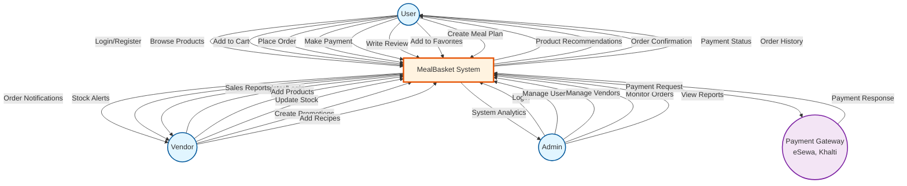

# MealBasket Data Flow Diagrams (DFD)

## DFD Level 0 - Context Diagram

## DFD Level 1 - Main Processes

```mermaid
flowchart TD
    %% External Entities
    User((User))
    Vendor((Vendor))
    Admin((Admin))
    PaymentGateway((Payment Gateway))

    %% Main Processes
    P1[1.0 User Management]
    P2[2.0 Product Management]
    P3[3.0 Order Processing]
    P4[4.0 Payment Processing]
    P5[5.0 Cart Management]
    P6[6.0 Review & Rating]
    P7[7.0 Recommendation Engine]
    P8[8.0 Meal Planning]
    P9[9.0 Vendor Management]
    P10[10.0 Admin Operations]
    P11[11.0 Inventory Management]

    %% Data Stores
    D1[(Users Database)]
    D2[(Products Database)]
    D3[(Orders Database)]
    D4[(Payments Database)]
    D5[(Carts Database)]
    D6[(Reviews Database)]
    D7[(Vendors Database)]
    D8[(Meal Plans Database)]
    D9[(Recipes Database)]
    D10[(Promotions Database)]

    %% User Management Flows
    User -->|Register/Login| P1
    P1 -->|User Data| D1
    D1 -->|User Profile| P1
    P1 -->|Profile Info| User

    %% Product Management Flows
    Vendor -->|Add/Update Products| P2
    P2 -->|Product Data| D2
    D2 -->|Product List| P2
    P2 -->|Product Info| User
    P2 -->|Product Info| P7

    %% Cart Management Flows
    User -->|Add/Remove Items| P5
    P5 -->|Cart Data| D5
    D5 -->|Cart Items| P5
    P5 -->|Cart Summary| User
    P5 -->|Cart Items| P3

    %% Order Processing Flows
    User -->|Place Order| P3
    P3 -->|Order Data| D3
    D3 -->|Order Status| P3
    P3 -->|Order Confirmation| User
    P3 -->|Order Details| P4
    P3 -->|Order Notification| Vendor
    P3 -->|Order Data| P10

    %% Payment Processing Flows
    User -->|Initiate Payment| P4
    P4 -->|Payment Request| PaymentGateway
    PaymentGateway -->|Payment Response| P4
    P4 -->|Payment Data| D4
    D4 -->|Payment Status| P4
    P4 -->|Payment Confirmation| User
    P4 -->|Payment Status| P3

    %% Review & Rating Flows
    User -->|Submit Review/Rating| P6
    P6 -->|Review Data| D6
    D6 -->|Review Data| P6
    P6 -->|Review Info| User
    P6 -->|Rating Data| P7

    %% Recommendation Engine Flows
    P7 -->|User Ratings| D6
    P7 -->|Product Data| D2
    P7 -->|User Data| D1
    P7 -->|Recommendations| User
    P7 -->|Similarity Scores| P2

    %% Meal Planning Flows
    User -->|Create/View Meal Plan| P8
    P8 -->|Meal Plan Data| D8
    D8 -->|Meal Plan| P8
    P8 -->|Meal Plan| User
    P8 -->|Recipe Data| D9
    P8 -->|Product Data| D2

    %% Vendor Management Flows
    Vendor -->|Register/Login| P9
    P9 -->|Vendor Data| D7
    D7 -->|Vendor Profile| P9
    P9 -->|Profile Info| Vendor
    Vendor -->|Create Promotion| P9
    P9 -->|Promotion Data| D10
    D10 -->|Promotion Info| P9
    P9 -->|Promotion Info| User
    Vendor -->|Add Recipe| P9
    P9 -->|Recipe Data| D9
    D9 -->|Recipe Info| P8

    %% Inventory Management Flows
    P2 -->|Stock Updates| P11
    P11 -->|Stock Data| D2
    D11[(Stock Alerts)]
    P11 -->|Stock Alerts| D11
    D11 -->|Alerts| Vendor
    P11 -->|Low Stock| P9

    %% Admin Operations Flows
    Admin -->|Manage Users| P10
    P10 -->|User Data| D1
    Admin -->|Manage Vendors| P10
    P10 -->|Vendor Data| D7
    Admin -->|Monitor Orders| P10
    P10 -->|Order Data| D3
    Admin -->|View Reports| P10
    P10 -->|Analytics| Admin

    %% Styling
    classDef entity fill:#e1f5ff,stroke:#01579b,stroke-width:2px
    classDef process fill:#fff3e0,stroke:#e65100,stroke-width:2px
    classDef store fill:#e8f5e9,stroke:#2e7d32,stroke-width:2px
    classDef gateway fill:#f3e5f5,stroke:#7b1fa2,stroke-width:2px

    class User,Vendor,Admin entity
    class P1,P2,P3,P4,P5,P6,P7,P8,P9,P10,P11 process
    class D1,D2,D3,D4,D5,D6,D7,D8,D9,D10,D11 store
    class PaymentGateway gateway
```

## Process Descriptions

### Level 0 - Context Diagram
Shows the MealBasket system as a single process interacting with external entities:
- **User**: Customers who browse, order, and review products
- **Vendor**: Sellers who manage products and fulfill orders
- **Admin**: System administrators who manage users and monitor operations
- **Payment Gateway**: External payment services (eSewa, Khalti)

### Level 1 - Main Processes

#### 1.0 User Management
- **Purpose**: Handle user registration, login, and profile management
- **Input**: User registration/login data
- **Output**: User profile information, authentication tokens
- **Data Store**: Users Database

#### 2.0 Product Management
- **Purpose**: Manage product catalog, including add, update, and delete operations
- **Input**: Product data from vendors
- **Output**: Product listings, product details
- **Data Store**: Products Database

#### 3.0 Order Processing
- **Purpose**: Process customer orders from cart to delivery
- **Input**: Order details from cart, payment confirmation
- **Output**: Order confirmation, order status updates
- **Data Store**: Orders Database

#### 4.0 Payment Processing
- **Purpose**: Handle payment transactions with external gateways
- **Input**: Payment request from user
- **Output**: Payment confirmation, transaction status
- **Data Store**: Payments Database
- **External**: Payment Gateway (eSewa, Khalti)

#### 5.0 Cart Management
- **Purpose**: Manage user shopping cart operations
- **Input**: Add/remove item requests
- **Output**: Cart summary, cart items
- **Data Store**: Carts Database

#### 6.0 Review & Rating
- **Purpose**: Collect and manage product reviews and ratings
- **Input**: Review and rating data from users
- **Output**: Review listings, rating averages
- **Data Store**: Reviews Database

#### 7.0 Recommendation Engine
- **Purpose**: Generate personalized product recommendations using collaborative filtering
- **Input**: User ratings, product data, user preferences
- **Output**: Recommended products with similarity scores
- **Data Stores**: Reviews Database, Products Database, Users Database

#### 8.0 Meal Planning
- **Purpose**: Help users plan meals with recipes and ingredients
- **Input**: Meal plan data, recipe selections
- **Output**: Meal plans, shopping lists
- **Data Stores**: Meal Plans Database, Recipes Database, Products Database

#### 9.0 Vendor Management
- **Purpose**: Manage vendor accounts, products, and promotions
- **Input**: Vendor registration, product data, promotion data
- **Output**: Vendor profile, product listings, promotions
- **Data Stores**: Vendors Database, Promotions Database, Recipes Database

#### 10.0 Admin Operations
- **Purpose**: Administrative functions for system management
- **Input**: Admin commands
- **Output**: User lists, vendor lists, order reports, analytics
- **Data Stores**: All databases

#### 11.0 Inventory Management
- **Purpose**: Monitor and manage product stock levels
- **Input**: Stock updates from orders and vendors
- **Output**: Stock alerts, low stock notifications
- **Data Stores**: Products Database, Stock Alerts

## Data Flow Summary

### User Flows
1. **Registration/Login** → User Management → Users Database
2. **Browse Products** → Product Management → Products Database
3. **Add to Cart** → Cart Management → Carts Database
4. **Place Order** → Order Processing → Orders Database
5. **Make Payment** → Payment Processing → Payments Database → Payment Gateway
6. **Write Review** → Review & Rating → Reviews Database
7. **View Recommendations** → Recommendation Engine → Multiple Databases
8. **Create Meal Plan** → Meal Planning → Meal Plans Database

### Vendor Flows
1. **Register/Login** → Vendor Management → Vendors Database
2. **Add Products** → Product Management → Products Database
3. **Update Stock** → Inventory Management → Products Database
4. **Create Promotion** → Vendor Management → Promotions Database
5. **Add Recipe** → Vendor Management → Recipes Database
6. **Receive Orders** → Order Processing → Orders Database
7. **Stock Alerts** → Inventory Management → Stock Alerts

### Admin Flows
1. **Login** → Admin Operations
2. **Manage Users** → Admin Operations → Users Database
3. **Manage Vendors** → Admin Operations → Vendors Database
4. **Monitor Orders** → Admin Operations → Orders Database
5. **View Reports** → Admin Operations → All Databases

## External Interfaces

### Payment Gateway Integration
- **Gateways**: eSewa, Khalti
- **Data Exchanged**: Payment requests, transaction IDs, payment status, signatures
- **Security**: SSL/TLS encryption, signature verification

### Future External Integrations
- **Email Service**: Order confirmations, notifications
- **SMS Service**: Delivery updates, OTP verification
- **Analytics Service**: User behavior tracking
- **AI/ML Service**: Advanced recommendations, demand prediction
