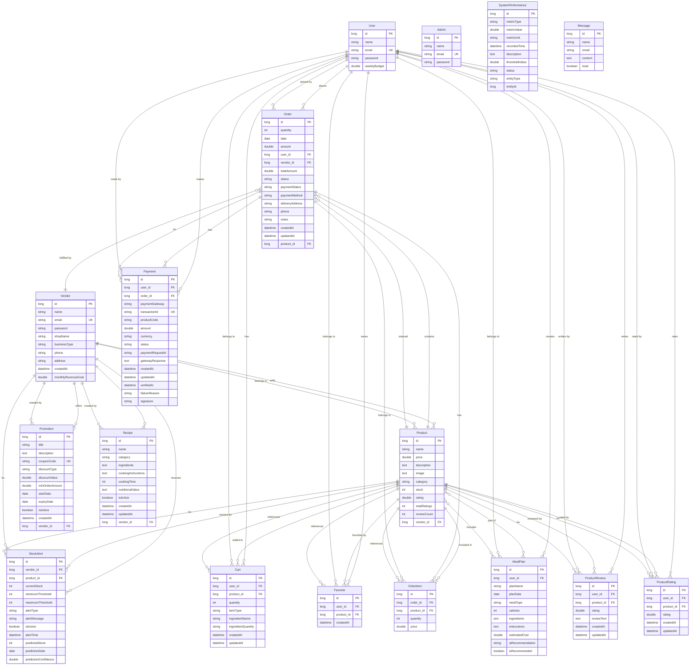

# MealBasket ER Diagram

## Entity-Relationship Diagram

## Relationship Summary

### Core User Flow
- **User** → **Cart** → **Order** → **OrderItem** → **Product**
- **User** → **Payment** → **Order**

### Vendor Flow
- **Vendor** → **Product** → **OrderItem** → **Order**
- **Vendor** → **Promotion** (discounts)
- **Vendor** → **Recipe** (meal suggestions)
- **Vendor** → **StockAlert** (inventory management)

### Product Relationships
- **Product** belongs to **Vendor**
- **Product** reviewed by **User** (ProductReview, ProductRating)
- **Product** favorited by **User** (Favorite)
- **Product** part of **MealPlan** (many-to-many)

### Meal Planning
- **User** creates **MealPlan**
- **MealPlan** includes multiple **Products**
- **MealPlan** has AI recommendations

### Inventory Management
- **Vendor** receives **StockAlert** for low/out of stock **Products**
- **StockAlert** includes predictions for future stock needs

### System Monitoring
- **SystemPerformance** tracks metrics (response time, error rate, etc.)
- Independent entity for monitoring purposes

### Communication
- **Message** for contact form submissions
- **Admin** for system administration

## Key Constraints

1. **Unique Constraints:**
   - User.email
   - Vendor.email
   - Admin.email
   - Payment.transactionId
   - Promotion.couponCode
   - ProductReview (user_id, product_id)
   - ProductRating (user_id, product_id)

2. **Foreign Keys:**
   - Product.vendor_id → Vendor.id
   - Order.user_id → User.id
   - Order.vendor_id → Vendor.id
   - Order.product_id → Product.id (legacy)
   - OrderItem.order_id → Order.id
   - OrderItem.product_id → Product.id
   - Cart.user_id → User.id
   - Cart.product_id → Product.id
   - Favorite.user_id → User.id
   - Favorite.product_id → Product.id
   - MealPlan.user_id → User.id
   - ProductReview.user_id → User.id
   - ProductReview.product_id → Product.id
   - ProductRating.user_id → User.id
   - ProductRating.product_id → Product.id
   - Payment.user_id → User.id
   - Payment.order_id → Order.id
   - Promotion.vendor_id → Vendor.id
   - Recipe.vendor_id → Vendor.id
   - StockAlert.vendor_id → Vendor.id
   - StockAlert.product_id → Product.id

3. **Many-to-Many:**
   - MealPlan ↔ Product (via meal_plan_products junction table)
